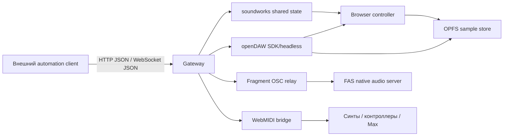

# Открытые проекты для онлайн DAW и семплеров с программным управлением

## Executive summary

Если нужна **почти готовая браузерная DAW**, лучший кандидат сейчас — **openDAW**: проект очень живой, у него есть собственный SDK/headless‑демо, семплеры, soundfont‑плеер, MIDI Output, импорт/экспорт DAWproject, хранение сэмплов в OPFS и активный релизный цикл. Но у него **нет публично задокументированного REST/WebSocket control plane**; для JSON/HTTP‑управления почти наверняка придется ставить собственный gateway поверх SDK или внутреннего store. citeturn12search0turn39search0turn26search0turn26search1turn9search6

Если приоритет — **сетевая управляемость, синхронизация, Max/MSP и WebSocket‑first архитектура**, а не готовая DAW‑морда, лучший фундамент — **soundworks**. Это не DAW “из коробки”, а framework для distributed music apps: WebSocket‑синхронизация состояния, clock sync, node‑clients, browser‑clients, готовый мост в Max через `soundworks-max`, плюс официальный tutorial именно для распределенного step‑sequencer. citeturn20search1turn15search2turn16search6turn16search3turn33view2turn33view3

Если нужен **OSC/MIDI/WebSocket‑heavy стек** и устраивает более необычная архитектура, сильный вариант — **Fragment + Fragment Audio Server**: браузерный collaborative UI, OSC in/out, MIDI/MPE in/out, WebSocket между фронтом и нативным C‑аудиосервером, documented packet protocol, импорт звуков и их преобразование в спектрограммы для ресинтеза. Это мощно, но сложнее в интеграции и, по публичным признакам, менее активно развивается, чем openDAW и soundworks. citeturn24view0turn22view4turn23view4turn22view1turn22view0turn23view1

**WAM Studio** и **WebDAW** полезны как эталонные WAM/WebAudio‑проекты и хосты плагинов, но по состоянию публичных репозиториев выглядят скорее как **прототипы/референсы**, а не как база для production‑SaaS с внешним API. **Web Synth** — очень сильная экспериментальная платформа с Rust/WASM на audio thread и богатым модульным графом, но тоже без готового сетевого control plane. citeturn14search0turn28search0turn36search0turn30view0turn41search2turn42view0turn43search3

Главный практический вывод такой: среди изученных проектов я **не нашел одного решения, которое одновременно давало бы полноценную web‑DAW/семплерную UX‑оболочку и при этом “из коробки” публичный JSON/HTTP/GraphQL API для внешнего управления**. Реалистичный путь — брать лучший аудио/UI‑кандидат и ставить перед ним **тонкий JSON/HTTP/WebSocket gateway**, который переводит команды в WebMIDI, OSC, WAM events, shared state или внутренний SDK. Это особенно хорошо ложится на openDAW, soundworks и Fragment. citeturn39search0turn20search1turn24view0turn36search0

## Карта проектов и быстрый отбор

Ниже — проекты, которые реально попадают в вашу зону интереса: полноразмерные web‑DAW, WAM‑хосты, collaborative аудио‑среды и distributed‑audio frameworks.

| Проект | Тип | Лицензия | Стек | Протоколы/управление | Аудио‑движок | Multiuser | Статус | Демо / хостинг / исходники |
|---|---|---|---|---|---|---|---|---|
| **openDAW** | полнофункциональная browser DAW + SDK/headless | **AGPL v3+** или commercial license | TypeScript + Rust, web app, headless SDK | WebMIDI, MIDI Output, JS‑скриптуемые девайсы; внешнего REST/WS API публично не описано | browser engine с AudioWorklet/worker‑архитектурой; roadmap и релизы указывают на WASM‑направление | в публичной продуктовой доке не раскрыто, но в community internals описаны collaborative editing и sync log | **активен** | `opendaw.studio`, GitHub, SDK/headless demos citeturn39search0turn12search0turn26search0turn27search0turn9search6 |
| **soundworks** | framework для distributed music apps | **BSD‑3-Clause** | Node.js + browser JS | WebSocket, shared state, sync plugin, filesystem/scripting plugins, Max bridge | движок не навязывает; можно использовать Web Audio или node‑web‑audio‑api | **да**, это core use case | **активен** | `soundworks.dev`, GitHub repo, examples, Max package citeturn20search1turn20search0turn16search2turn15search2turn33view3 |
| **Fragment + FAS** | collaborative synth / sampler / spectral environment | **BSD‑2-Clause** | browser JS + нативный C11 audio server | OSC in/out, MIDI/MPE in/out, WebSocket, Open Stage Control friendliness | **нативный** audio server, браузер — UI и графический контроль | **да** | **скорее low‑activity / stable niche** | `fsynth.com`, `github.com/grz0zrg/fsynth`, `github.com/grz0zrg/fas` citeturn24view0turn22view4turn23view1 |
| **WAM Studio** | web‑DAW на Web Audio Modules | **MIT** | browser JS, WAM, WebAudio, pixiJS/WebGL | MIDI, WAM event/state API; внешнего REST/WS control plane не видно | browser WebAudio + WAM plugins | не задокументировано как realtime multiuser | **прототип / похоже заброшен** | GitHub repo, academic papers citeturn14search0turn28search0turn28search17turn36search0 |
| **WebDAW** | pure client‑side browser DAW | **MIT** | TypeScript/React, Web Audio API, Web MIDI API | WebMIDI; WAM2 обозначен как целевая plugin‑архитектура; внешнего API не видно | browser WebAudio | не задокументировано | **дормант‑прототип** | GitHub Pages + repo + docs repo citeturn30view0turn41search2 |
| **Web Synth** | modular browser DAW/synth/experimentation platform | **GPL v2 or later** | WebAudio + Rust/WASM + WebGL + WebMIDI + SharedArrayBuffer + AudioWorkletProcessor | WebMIDI, sharing/loading; внешнего REST/WS API нет | **WASM на dedicated audio thread** | sharing есть, realtime multiuser не заявлен | **активный экспериментальный** | `synth.ameo.dev`, docs, GitHub citeturn42view0turn43search3turn43search2turn46view1 |

По смыслу эти проекты делятся на три корзины. **openDAW** — самый близкий к “настоящей” браузерной DAW. **soundworks** — лучший control‑oriented фундамент. **Fragment/FAS** — самый богатый по OSC/WebSocket/MIDI‑маршрутам, но наименее “стандартный” с точки зрения массовой DAW‑архитектуры. **WAM Studio** и **WebDAW** — полезные референсы, если вы хотите быстро собрать собственный WAM‑хост. **Web Synth** хорош, если вам нужен модульный browser DSP‑sandbox с сильным WASM‑уклоном. citeturn39search0turn20search1turn24view0turn14search0turn30view0turn42view0

## Протоколы управления и API

У большинства проектов поддержка есть не “по всем фронтам”, а **по подмножеству**: чаще всего это WebMIDI, внутренний JS/SDK API, иногда OSC через bridge, иногда WebSocket для state sync. Публичный **REST/GraphQL/JSON‑RPC** как продуктовый интерфейс среди них почти не встречается. citeturn39search0turn20search1turn24view0turn30view0turn42view0

Типовые **MIDI‑команды** в web‑стеке выглядят ожидаемо: в WEBMIDI.js можно вызывать `playNote()`, `sendControlChange()`, `sendPitchBend()`, а низкоуровнево отправлять массив байтов через `.send(...)`. В доке приведены, например, `playNote("C3")` и `sendControlChange(72, 64)`. Это важно, потому что для WAM‑хостов, WebDAW‑подобных приложений и Supersaw‑класса проектов именно MIDI чаще всего становится самым простым внешним control plane. citeturn18search0turn18search4

### Сравнение API и форматов сообщений

| Проект | Что поддержано нативно | Какие API видны публично | Пример/формат | Насколько легко подружить с JSON/HTTP |
|---|---|---|---|---|
| **openDAW** | WebMIDI, `MIDI Output`, скриптуемые devices (`Apparat`, `Spielwerk`, `Werkstatt`), SDK/headless demos | публичного REST/WS API не увидел; есть SDK/headless, `.od` bundles, DAWproject import/export | официальные demos показывают программные сценарии: drum pattern scheduling, automation, WAV import, mixer, metronome | **средне**: лучше всего оборачивать собственным HTTP gateway поверх SDK/headless citeturn39search0turn12search0turn9search6turn26search0 |
| **soundworks** | WebSocket state sync, sync clock, node/browser clients, Max | shared state + plugins; сырые WebSocket тоже документированы | docs прямо показывают создание `new WebSocket(...)`; distributed step sequencer использует глобальное состояние `running/startTime/BPM/score` | **легко**: JSON/HTTP шлюз ложится естественно на server state citeturn15search0turn33view0turn33view2turn33view3 |
| **Fragment/FAS** | OSC in/out, MIDI/MPE, WebSocket, OSC relay | documented OSC addresses и documented binary WebSocket packet protocol FAS | OSC: `/iarr`, `/aarr`, `/clear`; FAS: packet ids `0/1/2/3/4/6` для bank settings, frame data, synth settings и т.д. | **средне‑сложно**: мощно, но придется писать bridge либо бинарный клиент citeturn24view0turn22view0turn23view4turn22view1 |
| **WAM Studio** | MIDI + WAM host/plugin control | WAM API: `getState`, `setState`, `getParameterValues`, `setParameterValues`, `scheduleEvents` | WAM docs прямо показывают `const currentState = await wamNode.getState(); await wamNode.setState(currentState);` | **средне**: удобно, если ваш automation сидит в том же JS‑runtime, а не во внешнем HTTP‑клиенте citeturn14search0turn36search0turn36search8 |
| **WebDAW** | WebMIDI, planned WAM2 plugin architecture | публичный server API не документирован; pure client‑side app | опора — WebMIDI и внутренний app state; GitHub Pages демо есть | **сложно**: почти наверняка нужен форк или thin command layer внутри front‑end citeturn30view0turn41search2 |
| **Web Synth** | WebMIDI, sharing/loading, local state serialization | публичного REST/WS API не видно | composition/state описаны как JSON blob из `localStorage`; контроллеры и клавиатуры идут через WebMIDI | **средне‑сложно**: удобно для local automation, но не для готового HTTP API citeturn42view0turn43search3turn46view1 |

### Что важно знать по каждому проекту

У **openDAW** API‑история не выглядит как “открытый веб‑сервис”, зато у него есть важные строительные блоки: собственный SDK/headless‑пакет, примеры headless‑демо, формат `.od`, импорт/экспорт `.dawproject`, а также скриптуемые девайсы и MIDI Output. Это делает его хорошей мишенью для **внутрипроцессного** automation SDK и плохой мишенью для “подключился по REST и управляю DAW”. citeturn39search0turn12search0turn9search6turn26search0

У **soundworks** напротив, сеть — это ядро модели. Official docs прямо объясняют WebSocket data flow, shared state, remote monitoring/control, синхронизацию времени и даже distributed sequencer‑архитектуру с Node.js‑клиентами как дорожками и browser controller как панелью управления. Для Max есть отдельный пакет, который умеет мониторить и менять shared states. citeturn15search0turn33view0turn16search6turn33view2turn33view3

У **Fragment/FAS** сетевые интерфейсы лучше всех задокументированы: фронт может создавать OSC‑параметры через адреса, начинающиеся с `i` или `a`, очистка делается через `/clear`, а нативный FAS принимает шесть классов WebSocket‑пакетов с четко описанными структурами. Дополнительно система поддерживает MIDI input/output и MPE. Это очень близко к идеалу для “автоматизируемого browser instrument environment”, но не столь близко к классической DAW с традиционным track/clip API. citeturn24view0turn22view0turn23view4turn22view1

У **WAM Studio** и вообще в мире **Web Audio Modules** программное управление организовано в основном через host/plugin API: state snapshot, parameter values и sample‑accurate event scheduling. В WAM 2 важна именно идея, что host и plugin могут общаться эффективно и, при необходимости, через SharedArrayBuffer/ring buffer без лишнего crossing main↔audio thread barrier. Это сильный аргумент в пользу WAM‑пути, если вы делаете собственный browser host. citeturn36search0turn36search8

## Архитектурные детали

### Как устроены движки

У **openDAW** по публичным и community‑техническим материалам архитектура гибридная: top‑level проект собирает `boxGraph`, `editing`, `sampleManager`, `engine`, `tempoMap`, `audioUnitFreeze`; engine живет в `AudioWorklet`, а sample pipeline включает decode, peaks worker, OPFS‑storage, in‑memory cache и lazy `fetchAudio` RPC из worklet. Там же описаны offline render, freeze и project skeleton с бинарным заголовком `"OPEN"`. Это уже похоже на зрелую DAW‑архитектуру, а не на demo. citeturn26search0turn26search1turn27search0

У **soundworks** движок как таковой не навязан: проект фокусируется на распределенном состоянии, синхронизации и управлении. Это достоинство для вашей задачи: вы можете поставить любой audio layer — от обычного browser Web Audio до node‑web‑audio‑api на headless‑клиентах — и строить timeline/scheduler на общем мастер‑клоке. Официальный distributed step sequencer tutorial ровно это и делает. citeturn16search4turn16search6turn33view2

У **Fragment** браузер не рендерит звук напрямую. Он рисует/манипулирует WebGL‑данными, режет canvas на однопиксельные slices и передает RGBA‑поток по WebSocket в **FAS**, где нативный C‑сервер превращает это в звук. FAS умеет additive/spectral, PM/FM, granular, subtractive, wavetable, physical modelling, sampler и другие режимы, а поток slices обычно идет на 60 или 120 Гц. Это необычная, но очень сильная архитектура для гибридов “визуальный интерфейс ↔ серьезный DSP‑backend”. citeturn24view0turn22view4turn23view1

У **WAM Studio** и **WebDAW** центральна связка **Web Audio API + Web MIDI API + WAM plugins**. WAM‑материалы отдельно подчеркивают, что host/plugin communication сделан так, чтобы быть эффективным в сценарии “DAW и plugins находятся в AudioWorklet”, а для sample‑accurate events используется `scheduleEvents()` вместо попыток положиться только на main‑thread automation. citeturn28search0turn30view0turn36search0turn36search8

У **Web Synth** всё сильно заточено под производительность: Rust и другие DSP‑части компилируются в WebAssembly и крутятся на dedicated audio thread; сама платформа широко использует WebAudio, WebAssembly, WebGL, WebMIDI, `SharedArrayBuffer` и `AudioWorkletProcessor`. Автор прямо пишет, что это дает near‑native performance и low‑latency playback. citeturn42view0turn43search3

### Как хранятся сэмплы и проекты

Для **openDAW** это один из самых сильных пунктов: по release notes и community‑docs сэмплы сохраняются в **OPFS** с метаданными и peak‑данными, а sample pipeline строится вокруг content‑addressed UUID, worker‑генерации waveform peaks и lazy worklet fetch. Это именно та база, на которой удобно делать browser sampler без гигантских повторных декодов. citeturn12search0turn26search1

У **Fragment** импортированные аудиофайлы не используются “как есть”: они конвертируются в **стерео‑спектрограммы‑изображения**. После этого из этих изображений можно делать ресинтез, vocoder‑эффекты, granular/additive переработку и другие трансформации. Это мощно для sound design, но для “традиционного семплера MPC/Ableton‑типа” может быть избыточно и не всегда интуитивно. citeturn22view2

У **Web Synth** state целиком сериализуется обратно в браузерное хранилище; автор пишет, что saving/loading сводятся к JSON blob, представляющему состояние `localStorage`. Это удобно для local‑first сценариев и быстрых shareable snapshots, но не заменяет серверный asset store для production‑SaaS. citeturn42view0

У **WebDAW** проект pure client‑side и сам repo прямо говорит, что включает initial audio content через внешний `sample-pi` репозиторий. Это неплохая стартовая модель для прототипа, но не production‑история по отпуску/каталогу/лицензированию сэмплов. citeturn30view0

### Таймлайн, синхронизация и многопользовательский режим

Для **openDAW** в internal docs описаны `TempoMap`, PPQN‑to‑seconds conversion, offline render и collaborative editing/sync path. Но я бы был аккуратен: это видно в технических материалах contributor‑уровня, а не в явно user‑facing product docs, поэтому на реальный production‑multiuser без собственного аудита я бы не закладывался. citeturn26search0turn27search3

У **soundworks** многопользовательский сценарий — наоборот, основной use case: shared state синхронизируется через WebSockets, sync plugin выравнивает clocks, а примеры прямо показывают удаленный контроль и sequencer, где разные ноды сети совместно исполняют общую партитуру. Для вашей цели это самый убедительный стек, если “multiuser + automation” важнее полноценной DAW‑морды. citeturn33view0turn16search6turn33view2

У **Fragment** collaborative mode документирован прямо в README: online session делит fragment shader между пользователями, а часть настроек синхронизируется между участниками. Плюс в организации кода есть отдельный ShareDB server для collaborative features. Это уже не просто “сингл‑юзер synth с share link”. citeturn24view0



Эта схема — не описание одного существующего проекта, а наиболее практичный synthesis layer поверх изученных систем: **JSON/HTTP снаружи, нативные проектные интерфейсы внутри**. Именно так вы минимизируете зависимость от отсутствующих product‑grade REST API в existing web‑DAW проектах. Выше всего к такой схеме готовы soundworks, openDAW и Fragment. citeturn20search1turn39search0turn24view0

## Интеграция через JSON и HTTP

С точки зрения внешней автоматизации правило простое. **Не ищите “настоящий REST API” там, где проект задумывался как browser/app runtime.** Ищите проект, который удобно обернуть. По этому критерию **soundworks** — самый легкий, **openDAW** — самый перспективный, **Fragment** — самый мощный для OSC/WebSocket, но самый специфичный. citeturn20search1turn39search0turn24view0

| Проект | Оценка интеграции через JSON/HTTP | Почему |
|---|---|---|
| **soundworks** | **легко** | серверная модель и shared state уже сетевые; HTTP layer можно положить поверх WebSocket/state manager почти без ломки архитектуры citeturn15search0turn33view0turn33view2 |
| **openDAW** | **средне** | своего REST нет, но есть SDK/headless demos, импорт/экспорт проектов и зрелая engine/storage модель, значит обертка реалистична citeturn12search0turn9search6turn26search0turn26search1 |
| **Fragment/FAS** | **средне‑сложно** | documented OSC и binary WebSocket protocol есть, но семантика низкоуровневая и не “DAW‑дружелюбная” citeturn22view0turn23view4 |
| **WAM Studio** | **средне** | WAM API удобен внутри JS‑host, но не как внешний сервисный API citeturn36search0turn36search8 |
| **Web Synth** | **средне‑сложно** | отличный внутренний движок, но снаружи придется рулить через форк, store hooks или bridge к WebMIDI/state serialization citeturn42view0turn43search3 |
| **WebDAW** | **сложно** | pure client‑side, публичного automation API не видно, активность слабее citeturn30view0turn41search2 |

Практический минимальный command schema для внешнего управления я бы делал не project‑specific, а **унифицированным**. Например так:

```json
{
  "id": "cmd-1042",
  "at": 1720704000.125,
  "target": "track:drums/device:nano",
  "type": "note_on",
  "payload": {
    "note": 36,
    "velocity": 100,
    "lengthMs": 120
  }
}
```

```json
{
  "id": "cmd-1043",
  "target": "global",
  "type": "set_param",
  "payload": {
    "path": "transport.bpm",
    "value": 128
  }
}
```

```json
{
  "id": "cmd-1044",
  "target": "fragment",
  "type": "osc",
  "payload": {
    "address": "/iCutoff",
    "args": [0, 0.72]
  }
}
```

Дальше gateway просто переводит это в конкретный transport: для browser‑MIDI это note/CC/pitch‑bend, для Fragment — OSC, для soundworks — shared state patch, для openDAW — вызов SDK или mutation внутренней project model. Типовые MIDI‑операции, которые удобно маппить, уже есть в WEBMIDI.js: `playNote()`, `sendControlChange()`, `sendPitchBend()`. citeturn18search0turn18search4

Ниже — рабочий каркас **HTTP→command gateway**. Он не зависит от конкретного проекта и именно таким слоем обычно и закрывают отсутствие product‑grade REST API у browser‑DAW.

```js
import express from "express";

const app = express();
app.use(express.json());

// Здесь вы подключаете реальные адаптеры:
// - soundworksAdapter.patchState(...)
// - openDawAdapter.applyCommand(...)
// - fragmentAdapter.sendOsc(...)
// - midiAdapter.noteOn()/cc()

app.post("/api/command", async (req, res) => {
  const cmd = req.body;

  try {
    switch (cmd.type) {
      case "note_on":
        await midiAdapter.noteOn({
          note: cmd.payload.note,
          velocity: cmd.payload.velocity ?? 100,
          lengthMs: cmd.payload.lengthMs ?? 120,
          channel: cmd.payload.channel ?? 1,
        });
        break;

      case "set_param":
        await soundworksAdapter.patchState({
          path: cmd.payload.path,
          value: cmd.payload.value,
        });
        break;

      case "osc":
        await fragmentAdapter.sendOsc({
          address: cmd.payload.address,
          args: cmd.payload.args ?? [],
        });
        break;

      case "transport_play":
        await openDawAdapter.play({
          fromBar: cmd.payload?.fromBar ?? 1,
        });
        break;

      default:
        return res.status(400).json({ ok: false, error: "unknown_command" });
    }

    res.json({ ok: true, id: cmd.id ?? null });
  } catch (error) {
    res.status(500).json({
      ok: false,
      error: error instanceof Error ? error.message : String(error),
    });
  }
});

app.listen(3001, () => {
  console.log("Gateway listening on :3001");
});
```

А клиент automation может быть совсем примитивным:

```js
await fetch("http://localhost:3001/api/command", {
  method: "POST",
  headers: { "Content-Type": "application/json" },
  body: JSON.stringify({
    id: "cmd-1042",
    type: "note_on",
    payload: { note: 36, velocity: 110, lengthMs: 90, channel: 1 }
  })
});
```

## Ограничения и проблемные места

Первое ограничение — **браузерная платформа сама по себе**. Web MIDI работает только в secure context, не является Baseline‑фичей и не поддерживается во “всех самых массовых браузерах”. Поэтому любой browser‑first MIDI workflow нужно проверять как минимум на Chrome/Chromium и сразу готовить fallback‑режимы. Fragment docs отдельно предупреждают, что MIDI в Firefox не поддерживается. citeturn38search1turn38search3turn24view0

Второе — **SharedArrayBuffer и cross‑origin isolation**. Для low‑latency/WASM‑аудиостеков это не теоретика: MDN и web.dev прямо пишут, что shared memory становится доступной только в cross‑origin isolated окружении, а это уже COOP/COEP‑политики и потенциальные проблемы с third‑party embeds. Для проектов класса Web Synth и WAM‑хостов это может стать реальной деплой‑проблемой. citeturn38search0turn38search2

Третье — **тайминг и латентность**. В WAM 2 акцент делается на sample‑accurate event scheduling и на общении host↔plugin без crossing audio thread barrier через SAB/ring buffer. У Fragment автор прямо называет ограничением гранулярность событий, привязанную к monitor refresh rate: при 240 Гц это все еще хуже идеальных 1–3 мс, к которым хочется стремиться в музыкальном UX. Иначе говоря: “в браузере” можно сделать очень хорошо, но не магически отменить все ограничения платформы. citeturn36search8turn36search0turn24view0

Четвертое — **лицензии кода**. Если вы планируете SaaS или закрытую интеграцию, здесь есть реальные различия. **openDAW** распространяется по AGPL v3+ и отдельно предлагает commercial license; в README отдельно подчеркнуто, что публичное использование по сети тоже подпадает под AGPL‑логику. **Web Synth** лицензирован как **GPL v2 or later**, причем автор в лицензии прямо объясняет это зависимостью от Faust‑кода. **soundworks**, **WAM Studio**, **WebDAW**, **Fragment/FAS** в этом смысле мягче. citeturn39search0turn46view1turn20search1turn14search0turn30view0turn23view1

Пятое — **лицензирование сэмплов и демо‑контента**. Тут нельзя “верить README на слово”. Для примера, в Supersaw автор честно пишет, что часть MIDI и drum samples взята из бесплатных источников, а про часть материалов он уже не помнит происхождение. WebDAW тянет initial audio content из отдельного sample‑repo. Это означает одно: если вы делаете публичный продукт, **пакет sample assets нужно пересобирать и аудировать отдельно**, даже если код проекта вас полностью устраивает. citeturn42view1turn30view0

## Рекомендации и маршрут прототипа

Для вашей цели я бы рекомендовал три реальных сценария.

**Лучший общий кандидат — openDAW + собственный gateway.** Причина простая: это самый зрелый browser‑DAW среди найденных, с активной разработкой, headless demos, OPFS‑хранением сэмплов, DAWproject‑pipe и встроенными MIDI‑ориентированными устройствами. Если вам нужен именно “онлайн DAW/семплер”, а не просто control surface, это главный фаворит. Минус один: внешний API придется строить самому. citeturn39search0turn12search0turn26search1turn9search6

**Лучший control‑first кандидат — soundworks.** Если вы хотите, чтобы системой можно было уверенно рулить через JSON/HTTP/WebSocket/Max, а саму музыкальную оболочку допилить потом, это самый удобный фундамент. Он не дает вам готовую DAW, зато дает правильную сетевую модель, синхронизацию, distributed‑архитектуру и Max‑interop официально, а не “через костыли”. citeturn20search1turn33view0turn16search6turn33view3

**Лучший вариант для OSC/installation/media‑art use case — Fragment/FAS.** Я бы брал его, если вам нужен не классический clip launcher, а мощная управляемая аудио‑визуальная среда с documented OSC и нативным аудиосервером. Для MSP/Max это тоже хороший сосед через OSC‑экосистему, но тут уже выше входной порог и больше специфики. citeturn24view0turn22view0turn23view4

Для очень быстрого прототипа я бы шел так:

1. **Зафиксировать command schema**: `note_on`, `note_off`, `cc`, `set_param`, `transport_play`, `clip_trigger`, `load_sample`, `render_offline`.
2. **Поднять gateway** на Node/Express + WebSocket.
3. **Выбрать backend**: `soundworks` для control‑first или `openDAW` для DAW‑first.
4. **Сделать один transport‑adapter** для MIDI и один для OSC.
5. **Положить sample store** в OPFS/browser cache для local‑first сценариев; серверный asset catalog добавить отдельно.
6. **Проверить тайминг** на двух браузерах и одном контроллере до того, как вкладываться в сложный UI. Эта стадия особенно критична из‑за ограничений Web MIDI, SharedArrayBuffer и UI/audio scheduling. citeturn38search1turn38search0turn26search1turn33view2

Если нужен мой честный shortlist без дипломатии, он такой:

| Цель | Лучший выбор | Почему |
|---|---|---|
| Готовая browser DAW/семплерная база | **openDAW** | самый зрелый UI+engine+asset pipeline, но API придется обернуть самому citeturn39search0turn12search0turn26search1 |
| JSON/HTTP/WebSocket control как главное требование | **soundworks** | лучшая сетевая модель, sync, distributed apps, Max bridge citeturn20search1turn33view0turn33view3 |
| OSC/MPE/WebSocket и необычный DSP‑backend | **Fragment/FAS** | самый богатый documented control surface по OSC/WS/MIDI, но выше сложность citeturn24view0turn22view0turn23view4 |
| WAM‑host reference / учебная база | **WAM Studio** или **WebDAW** | удобно смотреть как референс WAM/WebAudio‑хоста, но не как production core citeturn14search0turn30view0turn36search0 |
| Экспериментальный WASM‑DSP browser lab | **Web Synth** | сильный modular/WASM low‑latency стек, но не product‑grade external API citeturn42view0turn43search3turn46view1 |

Если бы я собирал **ваш** прототип сегодня, я бы не спорил с реальностью и сделал так: **openDAW как основа DAW‑UX**, **soundworks как control/sync‑layer или как архитектурный ориентир**, и **тонкий JSON/HTTP gateway**, который переводит универсальные команды в WebMIDI / shared state / internal SDK calls. Это даст shortest path к системе, которой действительно можно управлять программно, а не только мышкой в браузере. citeturn39search0turn20search1turn18search0turn18search4